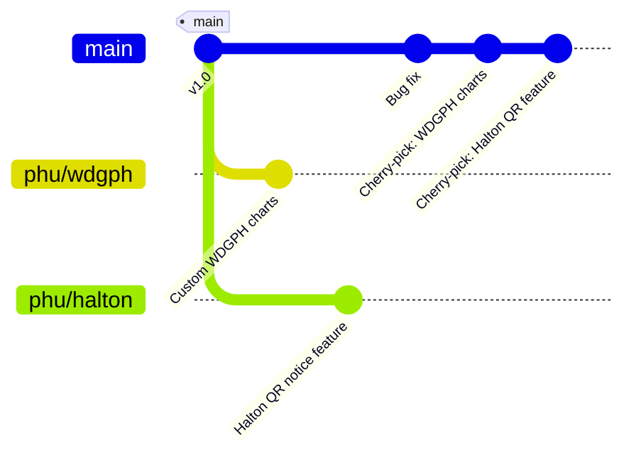

# VIPER Branching Strategy

This document outlines the branching strategy for the VIPER Pipeline project, including how the main branch, issue/feature branches, and Public Health Unit (PHU) branches will be used and managed. 

It also describes how changes flow between these branches and provides best-practice suggestions to keep the codebase maintainable. 

## Main Branch (VIPER Pipeline) 

**TLDR**; The main branch is the central, versioned branch of the repository. It contains the official codebase for the VIPER Pipeline and serves as the foundation from which all other branches are created.

A full list of characteristics for this branch are provided below: 

* **Single Source of Truth:** All production-ready code lives on main. It represents the latest stable version of the project, with all completed features and fixes integrated. 

* **Versioning:** The main branch is versioned. Releases are tagged or numbered on this branch, so we can track which version of the pipeline is deployed. For example, tags like v1.0, v1.1 etc. are used to mark release points. 

* **Issue Tracking:** Development on main is closely tied to issue tracking. Every change merged into main should correspond to a resolved issue, feature, or bug. This ensures traceability of changes (e.g., commit messages or merge requests should reference the issue ID). 

* **Stable and Tested:** Changes are merged into main only after they have been reviewed and verified (via testing) on an isolated branch. This keeps main in a deployable state. Continuous integration (CI) pipelines run on main to catch any integration issues immediately. By keeping the main branch stable and integrating changes frequently, we avoid long-lived divergence that could lead to difficult merges. The main branch is the integration point for all work, so it’s critical to keep it healthy and up-to-date. 

NOTE: unit tests are currently being used to verify code before release; our first full stable release will incorporate CI pipelines to run on main and catch all integration issues immediately.  

## Public Health Unit (PHU) Branches 

In addition to the main branch and short-lived issue branches, we maintain long-running Public Health Unit (PHU) branches, i.e. a dedicated branch for each Public Health Unit client. Each PHU branch contains customizations or configuration specific to that public health unit’s needs. This approach allows each PHU to have code tailored to its requirements without immediately affecting other PHUs or the main branch. 

This is what this looks like:

### Key aspects of PHU branches: 

One branch per PHU: We will have one persistent branch for each Public Health Unit (named accordingly, e.g. phu/phu-acronym). 

These branches are initially created from the main branch (ensuring they start with the core VIPER pipeline code). 

* Customized Features: PHU branches are used to develop and maintain features or changes that are specific to that particular PHU. For example, if PHU-A needs a custom reporting module that others don’t, that code can reside in PHU-A’s branch. 

* Tightly Aligned with Main: It is crucial that PHU branches stay as closely aligned with the main branch as possible. We want to avoid them drifting too far from main over time, because large divergences become difficult to merge later. To maintain alignment, we will regularly merge updates from main into each PHU branch. Ideally, whenever the main branch has new releases or important fixes, those changes should be propagated into all active PHU branches in a timely manner. This practice ensures each PHU branch benefits from the latest core improvements and security patches, and it minimizes the risk of merge conflicts down the line. 

* Issue Fixes on PHU vs Main: If an issue affects only a specific PHU, it may be addressed on that PHU’s branch directly (using an issue branch off the PHU branch, or committing to the PHU branch if urgent). If an issue affects the core system (even if discovered by one PHU), it should be fixed on an issue branch off main and merged into main first, then propagated to all PHU branches. This guarantees the fix is part of the core product. 

* PHU Branch Stewards: Each PHU branch will have a main steward responsible for that branch. This should be documented in the branch specific README.

## Integrating Changes Between Main and PHU Branches 

One of the most important aspects of this strategy is managing the flow of changes to and from the PHU branches: 

* **Pulling Main into PHU Branches:** 
    - Whenever the main branch is updated (new feature release, bug fix, etc.), those changes should be merged into each PHU branch. 
    - This could be done immediately or on a regular schedule (e.g., after each release, or at sprint end). 
    - Frequent merges from main into the PHU branches keep them up-to-date and prevent large divergence. This means integrating main’s changes in smaller batches, which reduces merge complexity compared to a huge catch-up merge after a long time. 

* **Pushing PHU Features to Main:** 
    - If a PHU-specific feature or enhancement is deemed useful for the core product (VIPER pipeline), we should integrate it back into the main branch so all PHUs can benefit. 
    - To do this, the changes can be cherry-picked or merged from the PHU branch into main once the feature is proven and approved. 

### Cherry-Picking  
Cherry-picking means selecting specific commits from the PHU branch and applying them to main (as opposed to merging the entire branch). 

**We prefer cherry-picking when the PHU branch contains other changes we don't want in main; this allows us to grab just the relevant commit(s).**
*  For example, if PHU-A implemented a new data visualization feature that could be useful to everyone, we would cherry-pick the commits for that feature from phu-A branch into main. 
* After cherry-picking, the feature would go through the normal review/testing process on main before becoming part of the next release. 
* In cases where the PHU branch is almost identical to main except for the new feature, a direct merge or opening a pull request from the PHU branch to main is also possible. 

### Cherry-Picking vs. Merging

The decision between cherry-pick vs. merge will be made based on how isolated the feature is: 

* If the PHU branch has diverged significantly or has multiple in-progress changes, cherry-pick the specific commit(s) of the target feature. 
* If the PHU branch is only slightly ahead of main or the feature required changes scattered across many files/commits, it might be cleaner to do a merge (after perhaps rebasing or isolating the changes). 

**TLDR; In our workflow, the default approach will be to cherry-pick PHU features into main for controlled integration, unless a merge is clearly more feasible.** 

## Testing and Code Review: 

Any code coming from a PHU branch into main should undergo the same quality checks as any other feature. 

This means a code review (pull request) on main and running the full test suite. By treating PHU-contributed code as a regular contribution to main, we maintain code quality and consistency in the core product. These practices echo a strategy some teams use for managing client-specific customizations: develop on a client (PHU) branch, then merge or cherry-pick the changes back to the main product if they are broadly useful. Likewise, main’s improvements flow back out to all client/PHU branches to keep them in sync. 

## Versioning and Releases 

The VIPER Pipeline’s releases will be managed on the main branch (with tags). 

Here’s how versioning ties into our branching: 

* The main branch reflects the latest development version (or the upcoming release). 

* When we reach a release milestone (say version 2.0), we may tag that commit as v2.0. In some cases, we might create a separate release branch at that point (e.g., a branch release/2.0 for post-release hotfixes), but if not necessary, tagging the main commit is sufficient. 

### PHU Deployments: 

Each PHU might not take every release immediately or might be on a slightly different schedule. We will coordinate with each PHU to decide which release tag of main they adopt. When a PHU is ready to upgrade to a new main version, we merge the appropriate main changes into their branch and perform testing on that PHU branch. Essentially, the PHU branch will incorporate the new version from main (plus any PHU-specific tweaks). 

### Hotfixes: 

If an urgent bug fix is needed in production, the fix should be applied to main (often via a hotfix branch off main for the bug) and then rapidly merged/cherry-picked into any affected PHU branches. This ensures consistency in bug fixes across all deployments. By versioning the main branch and coordinating merges, we ensure that each PHU branch can explicitly refer to which version of the core it’s based on (for example, PHU-A’s branch might be based on VIPER v2.0 plus additional changes). Keeping a clear mapping of versions helps in planning upgrades and troubleshooting. 

## Best Practices and Suggestions 

While the above strategy is designed to accommodate PHU-specific needs, it does introduce complexity. The following best practices and suggestions will help manage this workflow effectively: 

**Frequent Integration:**

* Merge changes frequently between main and PHU branches (in both directions) rather than letting branches drift. 
* Regular integration prevents large, error-prone merges. 
* Short-lived, frequent merges make it easier to resolve conflicts and keep code consistent. 

**Documentation of Differences:** 
* Keep track of what customizations each PHU branch contains. 

* This can be done in the README of the branch; a decision to be made later is whether a CHANGELOG can be used for each branch.

* When evaluating whether a PHU customization can be upstreamed, having a list of differences helps prioritize and plan those integrations. 

**Code Review and Governance:** 

* Treat the PHU branches with the same rigor as main. 

* Even though they are separate, use pull requests for changes on PHU branches when possible, and include at least one other developer in reviews. 

* This ensures quality and that at least one other person is familiar with the PHU-specific code. It also makes it easier to later migrate those changes to main, since they will be better understood. 

**Configuration Over Branching (Long-Term):** 

* Over time, consider if some PHU-specific variations can be handled via configuration, feature flags, or a plugin/module system instead of permanent branch divergence. 

* Industry research suggests that maintaining many branched variants of a product can be costly and error-prone. In practice, this means building the ability to turn features on/off or alter behavior through settings, rather than maintaining separate code forks. 

* This approach can reduce the need for separate branches per PHU in the long run. It might be a significant architectural effort, but it's worth keeping in mind as the project evolves. 

**Regular Coordination:**

* When branch strategy is rolled out, we should hold periodic sync meetings among developers of different PHU branches and main. 

* In these, review recent changes in each branch and decide if some PHU changes should be moved to main or if upcoming main changes might impact any PHUs. 

 

## Summary 

In summary:

* This branching strategy allows each Public Health Unit to have the custom functionality they require while still benefiting from a common core (the main VIPER pipeline). 

* By using issue-specific branches and disciplined merging, we maintain a high level of code quality and reduce integration pain. 

* It will be important to remain vigilant in synchronizing branches and to continuously refine our process. 

**This document will be updated as our team gathers feedback on the workflow, and as tools or practices evolve. With good collaboration and these guidelines, our branching strategy will support both rapid development and the necessary customization for each PHU, without letting the codebases drift apart.**