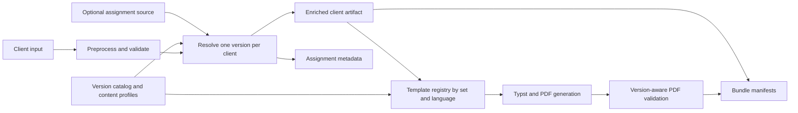

# Notice Versioning and A/B Testing Exploration

Status: design exploration; no implementation is authorized by this document.

This plan explores an optional, backward-compatible way to generate different
notices for different clients. It covers materially different notices, such as
an affirmative schedule reminder for clients who are up to date, as well as
smaller variations in wording, contact information, links, and other
configuration-driven content.

The plan also generalizes the school-specific contact mapping proposed in
[PR #80](https://github.com/WDGPH/ImmuKnow/pull/80). That proposal demonstrated a
real need, but its discussion identified two broader questions: school names are
not guaranteed to be unique, and assignment may be cleaner when a version is
selected for each client before the notice pipeline runs.

## Decision to make

Choose how notice versions are assigned:

1. an optional version column in the primary client input;
2. a separate client-to-version assignment manifest; or
3. a rule and experiment engine inside VIPER.

All three options can use the same version catalog, rendering contract, and
audit metadata. The assignment mechanism is the main decision; it should not be
coupled to how templates are written.

## Recommended direction

Build the shared version catalog and resolver, but start with explicit
assignment only:

- Preserve the current notice as the default when versioning is not enabled.
- Define stable version identifiers in a small version catalog.
- Support either an optional input column or a separate assignment manifest,
  selected explicitly for a run.
- Put the resolved version and its provenance in the preprocessed artifact and
  a dedicated assignment metadata file.
- Keep long-form prose and layout in versioned templates. Permit only a narrow,
  validated set of content-profile overrides such as phone, email, address,
  website, schedule URL, and reporting URL.
- Defer in-pipeline randomization, demographic balancing, and geographic rules
  until there is a demonstrated operator need that cannot be met upstream.

This direction gives experimental-design teams exact control over assignments,
keeps VIPER deterministic, and provides a direct path to school- or
geography-specific communication without turning the notice pipeline into a
general-purpose rules engine.

## Goals

- Keep the feature completely optional and preserve current output by default.
- Allow more than one notice version in a single run.
- Support materially different notice kinds, including:
  - the existing overdue notice;
  - an affirmative notice that thanks clients who are up to date, reminds them
    of the official schedule, and explains reporting obligations and methods;
  - future informational or campaign-specific notices.
- Support smaller variants that share a template but change approved content
  values or optional sections.
- Record exactly which version was generated for each client.
- Support externally designed experiments, including exact demographic or
  geographic balancing.
- Allow future school, municipality, or other scope-specific communication
  without relying on ambiguous names.
- Fail before PDF generation when assignments, templates, eligibility, or
  overrides are invalid.

## Non-goals

- Implement notice versioning on this branch.
- Build an experiment-analysis or outcome-tracking system.
- Infer that a client is up to date solely because `OVERDUE DISEASE` is blank.
  The source system or explicit assignment must establish eligibility.
- Allow per-version overrides of operational settings such as encryption,
  bundling, cleanup, compiler configuration, or output paths.
- Maintain separate code branches for every notice version, school, or
  geography.
- Generate multiple production notices for the same client in one run. A
  separate preview workflow can render all variants for review.

## What the current architecture already provides

The current pipeline has several useful extension points:

- `ClientRecord.metadata` can carry resolved assignment information through the
  artifact without adding experimental fields to every pipeline function.
- The preprocessed artifact is the downstream source of truth and already
  carries run and client provenance.
- Template modules are dynamically loaded by language from a selected template
  directory.
- PDF validation emits per-file metadata, while bundling emits manifests paired
  with client IDs.
- Normalized client records include school, board, city, language, and stable ID
  fields that can support assignment after their source quality is validated.

There are also constraints that an implementation must address:

- One template directory is selected for the entire run; renderers are keyed
  only by language.
- Notice generation and preprocessing currently contain default-configuration
  reads. Versioning requires every relevant step to receive the selected config
  explicitly so custom runs do not mix configuration sources.
- The input filter retains a fixed set of columns, so optional assignment fields
  must be deliberately mapped and preserved.
- The current PDF rules assume a two-page overdue notice with the signature on
  page one. An affirmative template may legitimately have a different layout.
- PDF and bundle lookup currently depend on the existing filename convention.
  Version metadata should not require a filename migration in the first phase.

## Keep five concepts separate

### Notice kind

The semantic contract of the communication, for example `overdue`,
`affirmative`, or `informational`. A kind defines eligibility and required data.

- `overdue`: requires at least one overdue disease.
- `affirmative`: requires an explicit source assertion or assignment that the
  client is eligible; normally expects no overdue diseases.
- `informational`: may permit either state if the specific version says so.

This guard prevents an experimental assignment from accidentally thanking an
overdue client for being up to date.

### Notice version

A stable, analysis-safe identifier for the exact communication contract, such
as `overdue_standard_v1`, `overdue_plain_language_v1`, or
`affirmative_schedule_v1`. Identifiers should be immutable after use. Content
changes that can affect interpretation create a new version.

### Template set

The language-specific renderer and assets. Versions with materially different
structure use different template sets. Minor variants can share a template set.

### Content profile

A validated collection of non-prose values such as contact details and URLs.
Profiles can be reused by many versions or scopes, which avoids copying complete
contact blocks for every school as PR #80 did.

Long-form English and French copy should remain in templates, where layout and
translation can be reviewed together. Configuration should hold data, not large
paragraphs of Typst-aware prose.

### Experiment context

The optional experiment identifier, arm, and assignment method describe why a
client received a version. They do not define the version itself. The same
approved notice version may be reused in another experiment with a different arm
label, or outside an experiment entirely. Experiment context therefore belongs
to assignment input and audit metadata, not the immutable version catalog.

## Proposed data flow



Resolution occurs once. Downstream steps consume the enriched artifact rather
than independently interpreting assignment inputs or merging configuration.
This preserves the pipeline's artifact-driven boundaries and gives validation,
encryption, and bundling one authoritative version value for each client.

## Shared version catalog

A separate `notice_versions.yaml` within the selected config directory would
keep this optional feature out of the core operational settings. The following
is illustrative, not a final schema:

```yaml
schema_version: 1
default_version: overdue_standard_v1

content_profiles:
  central:
    phone: 555-555-5555 ext. 1234
    email: records@example.ca
    address: 123 Example Street, Example, ON A1A 1A1
    website: https://example.ca/immunization
    schedule_url: https://example.ca/schedule
    reporting_url: https://example.ca/report

  north_satellite:
    extends: central
    phone: 555-555-5555 ext. 4321
    address: 10 North Street, Example, ON A1A 1A2

versions:
  overdue_standard_v1:
    kind: overdue
    template_set: overdue_standard
    content_profile: central
    eligibility:
      overdue: required
    validation_profile: overdue_two_page

  overdue_plain_language_v1:
    kind: overdue
    template_set: overdue_plain_language
    content_profile: central
    eligibility:
      overdue: required
    validation_profile: overdue_two_page

  affirmative_schedule_v1:
    kind: affirmative
    template_set: affirmative_schedule
    content_profile: central
    eligibility:
      overdue: forbidden
    validation_profile: affirmative_one_page
```

Only one level of profile extension should be allowed. Circular or multi-level
inheritance creates hard-to-explain effective configuration and should fail
validation.

The override allowlist should initially be limited to notice content and assets:

- contact address, phone, email, and website;
- schedule and immunization-reporting URLs;
- approved optional-section flags;
- logo/signature or another reviewed asset set;
- a validation profile appropriate to the template.

Encryption, password templates, QR enablement, bundling, cleanup, compiler
settings, source paths, and other run-level behavior remain global. If a future
variant needs a different QR destination, expose a version-resolved content URL
to the existing global QR template rather than deep-merging the whole QR config.

## Assignment option A: optional input column

Add an optional `NOTICE VERSION` column to the primary input. Blank values use
the catalog default; unknown values fail before rendering.

Example:

```text
CLIENT ID | SCHOOL ID | NOTICE VERSION                  | EXPERIMENT ID    | EXPERIMENT ARM
100000001 | SCH-101   | overdue_standard_v1             | copy_test_2027   | A
100000002 | SCH-101   | overdue_plain_language_v1       | copy_test_2027   | B
100000003 | SCH-205   | affirmative_schedule_v1         |                  |
```

### Operator experience

- The team preparing the existing Excel or CSV file adds one column.
- Experimental design, demographic balancing, and geography logic happen in the
  source workflow where richer data and established analytic tools are
  available.
- VIPER validates and renders the supplied assignments but does not decide them.
- Existing users make no changes if the feature is disabled.

### Advantages

- Smallest implementation and documentation surface.
- Exact, reviewable experimental allocation.
- Stable assignments across reruns and changes in input ordering.
- Handles one-off client exceptions naturally.
- Keeps sensitive balancing variables out of VIPER metadata.

### Disadvantages

- Couples experimental assignment to the operational notice input.
- Reusing the same source extract for another experiment requires editing or
  regenerating that file.
- Spreadsheet users can mistype version identifiers without upstream controls;
  VIPER must fail clearly and summarize accepted identifiers.

### Expected complexity

Low to medium. Changes are concentrated in input-column handling, preprocessing,
catalog validation, renderer selection, and metadata output.

## Assignment option B: separate assignment manifest

Accept a second CSV or JSON file that maps client ID to notice version. The
primary health record export remains unchanged.

Example CSV:

```text
CLIENT_ID,NOTICE_VERSION,EXPERIMENT_ID
100000001,overdue_standard_v1,overdue_copy_2027
100000002,overdue_plain_language_v1,overdue_copy_2027
100000003,affirmative_schedule_v1,affirmative_2027
```

### Operator experience

- An analyst or experiment tool produces an assignment manifest.
- The notice operator supplies it with a new CLI option such as
  `--notice-assignments assignments.csv`.
- VIPER requires exactly one assignment per processed client unless the run is
  explicitly configured to use the default for missing rows.
- Extra manifest rows, duplicate client IDs, missing clients, and unknown
  versions produce a preflight report and fail by default.

### Advantages

- Clean separation between source health data and experimental design.
- Best option for exact demographic balancing, blocked randomization, and
  assignments approved by another system.
- The manifest can be retained as an experiment artifact in approved secure
  storage without modifying the health record extract.
- Easy to reuse a source extract with a different approved assignment plan.

### Disadvantages

- Adds another file that operators must keep paired with the correct extract.
- Client-ID normalization and coverage checks must be exact.
- Requires clear handling of missing, duplicate, and out-of-cohort assignments.

### Expected complexity

Medium. It needs a second input contract, join validation, CLI plumbing, and
helpful reconciliation reporting, but the assignment algorithm remains outside
VIPER.

## Assignment option C: in-pipeline rules and experiments

VIPER selects a version from configured scope rules and/or a deterministic
experiment definition.

Illustrative scope rules:

```yaml
assignment:
  mode: scope_rules
  default_version: overdue_standard_v1
  rules:
    - id: north-office-schools
      match:
        school_id: [SCH-101, SCH-102]
      version: overdue_north_contact_v1
    - id: town-reminder
      match:
        city: [Exampletown]
      version: overdue_town_v1
```

A deterministic experiment could hash a stable combination such as
`experiment_id + assignment_seed + client_id` into weighted arms. This is
reproducible and independent of row ordering, but it provides approximate—not
exact—balance within demographic strata.

Exact blocked or stratified balancing inside VIPER would require a two-pass
cohort algorithm, explicit stratum definitions, minimum-cell handling, and rules
for what happens when clients are added or removed. That is a substantial and
separate experimental-design feature.

### Operator experience

- A config author defines match rules, arm weights, and an assignment seed.
- The operator runs the pipeline without preparing assignments elsewhere.
- A preflight summary must show counts by version, rule, and scope before PDF
  generation.

### Advantages

- Convenient for recurring geographic or school-specific campaigns.
- One configuration can assign and render a cohort.
- Deterministic hashing supports simple random A/B allocation without a second
  file.

### Disadvantages

- Highest cognitive and implementation complexity.
- Assignment becomes less visible to operators and harder to review before a
  run.
- Free-text city values and synthesized school IDs can silently misclassify
  clients if treated as authoritative.
- Rule precedence, overlapping scopes, exclusions, reruns, weight changes, and
  experiment freezes all need durable contracts.
- VIPER becomes partly responsible for experimental design rather than only
  notice production.

### Expected complexity

High. It requires a selector language, conflict detection, deterministic
allocation, preflight UX, assignment persistence, and a much larger test matrix.

## Option comparison

| Criterion | A: input column | B: assignment manifest | C: pipeline rules |
|---|---|---|---|
| Initial implementation | Lowest | Moderate | Highest |
| Routine operator steps | One input file | Two paired files | One input plus complex config |
| Exact demographic balance | Excellent upstream | Excellent upstream | Poor without major added logic |
| Geographic customization | Assigned upstream | Assigned upstream | Native |
| Assignment transparency | High | Highest | Requires strong preflight UX |
| Reproducibility | High | Highest | High only with frozen rules and seed |
| One-off exceptions | Easy | Easy | Awkward without override precedence |
| Risk of hidden precedence | Low | Low | High |
| Maintainer burden | Low | Moderate | High |
| Generalizes PR #80 | Yes, upstream map | Yes, external map | Yes, internal map |

Option B is the cleanest experimental-design boundary. Option A is the simplest
operator workflow when the upstream export can already contain the assignment.
Both can share nearly all implementation code. Option C should be a later,
evidence-driven addition rather than the first release.

## Notice-creation workflow by role

| Role | Default workflow | Explicit-assignment workflow | Rule-engine workflow |
|---|---|---|---|
| Notice operator | Runs VIPER exactly as today | Supplies the selected assignment source and reviews preflight counts | Selects a rules config and reviews rule-level counts and conflicts |
| Communications editor | Reviews the existing EN/FR template pair | Creates or revises a versioned EN/FR template set and its layout expectations | Same template work, plus review of every scope that can select it |
| Config steward | Maintains one operational config | Registers immutable versions and reusable content profiles | Also maintains selectors, priorities, seeds, weights, and exclusions |
| Experiment analyst | Works outside VIPER | Produces the version column or secure manifest and later joins outcomes by client ID | Reviews pipeline allocation logic and exported assignments before analysis |
| Release reviewer | Reviews one representative output per language | Reviews every new notice kind and representative variants, plus assignment metadata | Also reviews dry-run resolution across overlapping rules and cohort changes |

The first release should optimize for the notice operator: a normal run remains
unchanged, while an experimental run adds one clearly named assignment input and
one preflight approval point. Template authors should not need to understand the
assignment algorithm, and analysts should not need to edit Typst or operational
configuration.

## Assignment-mode contract

The pipeline should use one assignment mode per run. It should not silently
combine an input column, a manifest, geographic rules, and random assignment.

Suggested modes:

- `fixed`: all clients receive the configured default version; current behavior.
- `input_column`: read `NOTICE VERSION` from the primary input.
- `manifest`: join a separate assignment file by client ID.
- `scope_rules`: possible future mode.
- `deterministic_experiment`: possible future mode.

If more than one source is configured, fail with instructions to choose one.
This is simpler and safer than a long precedence ladder. A future, explicit
manual-override mechanism can be added if real workflows require it.

## Stable identifiers for school and geography

Scope-specific communication should select a version or content profile by
stable identifiers, not inject fields directly into templates.

- Prefer source `SCHOOL_ID` over school name.
- Prefer source `BOARD_ID` over board name.
- Treat synthesized IDs as convenience identifiers, not authoritative targeting
  keys. A renamed school produces a different synthesized ID.
- Normalize and validate municipality codes if city/town assignment becomes a
  production feature. The current contact city is free text and is not a safe
  rules key by itself.
- Reject overlapping rules that assign different versions at the same declared
  priority. Do not rely on incidental YAML order.

For the PR #80 use case, several schools could be assigned to a version that
references `north_satellite`, while all remaining clients use the default
`central` profile. The contact data is defined once, the selector uses stable
IDs, and the resolved profile is auditable per client.

## Affirmative-notice contract

An affirmative notice is not merely the overdue template with an empty list.
It has a different semantic and layout contract.

It should be able to:

- thank or applaud the client/family for being up to date;
- remind them to continue following the official immunization schedule;
- explain the obligation to report new immunizations;
- provide approved reporting methods and links;
- optionally include the recorded immunization history, depending on the
  selected template;
- omit the overdue-disease list and any wording that implies missing doses.

Safety rules:

- Do not infer affirmative eligibility from a blank overdue cell unless the
  source-data contract explicitly guarantees that meaning.
- Fail if an `affirmative` version is assigned to a client with overdue diseases,
  unless a future version explicitly permits that state.
- Fail if an `overdue` version is assigned without overdue diseases.
- Validate English and French variants independently.
- Give each template a validation profile. Do not globally weaken the existing
  two-page checks merely because an affirmative notice may be one page.

The input can continue to include the required `OVERDUE DISEASE` column with
blank values for affirmative clients in the first phase. Making that column
conditionally optional would broaden preprocessing and should be evaluated
separately.

## Rendering design

Replace the run-global language renderer map with a registry keyed by template
set and language:

```text
(template_set, language) -> renderer
```

Resolve each client's version once, before rendering. Pass a typed resolved
notice object into QR generation, template context construction, validation,
and manifest generation rather than reopening and deep-merging YAML in each
step.

Conceptual resolved object:

```text
ResolvedNotice
  notice_version
  notice_kind
  template_set
  content_profile
  experiment_id
  experiment_arm
  assignment_source
  validation_profile
  catalog_digest
```

The existing output filename can remain
`{language}_notice_{sequence}_{client_id}.pdf`. One client receives one notice,
so adding the version to filenames is not necessary and would force changes in
validation, encryption, and bundling. The canonical metadata supplies the
version. A preview command may use version-bearing filenames because it is not a
production delivery artifact.

## Metadata and audit trail

Write a dedicated file before QR or Typst generation:

```text
output/metadata/notice_assignments_{run_id}.json
```

Illustrative record:

```json
{
  "run_id": "20270115T140000",
  "client_id": "100000001",
  "sequence": "00001",
  "language": "fr",
  "notice_version": "overdue_plain_language_v1",
  "notice_kind": "overdue",
  "template_set": "overdue_plain_language",
  "content_profile": "central",
  "experiment_id": "overdue_copy_2027",
  "experiment_arm": "B",
  "assignment_source": "manifest",
  "catalog_digest": "sha256:..."
}
```

The top-level file should also contain schema version, creation time, input and
catalog digests, assignment mode, default version, total clients, and counts by
version. Records should contain client ID but not name, date of birth, address,
or balancing attributes.

Assignment manifests and emitted assignment metadata contain client identifiers
and must receive the same access controls, retention rules, secure transfer, and
cleanup treatment as the existing client artifacts. They must never be committed
to this public repository. Experiment strata used upstream should not be copied
into VIPER output unless there is an approved analysis requirement.

The same resolved fields should be generated from one in-memory object and
included in:

- `ClientRecord.metadata`, so downstream steps receive the assignment;
- the preprocessed artifact, which remains the source of truth;
- bundle-manifest client entries, so delivered bundles can be audited;
- a run summary with counts by version and language.

Avoid independent copies that can drift. The dedicated assignment metadata is
the analysis-friendly projection of the artifact's resolved values.

Do not expose experiment arms in visible PDF text or filenames by default. If a
business need arises to embed a version in PDF metadata, assess whether it could
unblind an experiment or disclose internal campaign information. Pairing output
filenames and checksums in the delivery manifest is usually sufficient.

## Reproducibility and experimental design

- Explicit input and manifest assignments are immutable inputs and therefore
  preferred for formal experiments.
- Treat experiment ID and arm as assignment provenance. Do not encode them into
  the notice version or infer them from an arm label alone.
- Store input, assignment, catalog, and template digests with the run.
- Never reuse a version identifier after changing its semantic content.
- If deterministic hashing is later implemented, freeze the experiment ID,
  seed, arm weights, and eligibility definition. Changing weights can reassign
  clients even when the hash function is stable.
- Rerunning a previously delivered cohort should reuse its emitted assignment
  manifest rather than recompute assignments from changed rules.
- Exact balance by age, geography, school, or other strata belongs upstream or
  in a dedicated assignment tool. Approximate hash allocation should be labeled
  honestly.

## Preflight user experience

Before generating any QR codes or PDFs, print and persist a preflight summary:

```text
Assignment mode: manifest
Clients: 1,250
overdue_standard_v1: 625
overdue_plain_language_v1: 625
Unassigned clients: 0
Unknown versions: 0
Eligibility conflicts: 0
Unsupported language/template pairs: 0
```

Fail-fast messages should identify the client ID, supplied version, source row,
and accepted version IDs without displaying names or dates of birth.

A later `--plan-notices` or `--dry-run` mode could validate assignments, show
counts, and write metadata without rendering PDFs. This would be particularly
valuable for rule-based assignments, but it is not required for the first
explicit-assignment release.

## Validation and testing strategy

### Configuration and assignment unit tests

- disabled versioning preserves the current default exactly;
- catalog IDs are unique and immutable strings;
- referenced template sets, profiles, languages, and validation profiles exist;
- profile extension is limited to one level and cycles fail;
- disallowed operational overrides fail;
- unknown, duplicate, missing, and extra assignments fail as configured;
- assignment is stable by client ID and independent of input ordering;
- affirmative/overdue eligibility conflicts fail before rendering.

### Integration tests

- one artifact can contain multiple resolved versions;
- mixed template sets render in both English and French;
- QR, encryption, validation, and bundling preserve assignment metadata;
- bundle manifests pair every client ID with the delivered version;
- custom `--config` and `--template` selections are honored by every step;
- school-specific profiles use `SCHOOL_ID` and fall back explicitly;
- current filename and client-ID validation contracts remain intact.

### End-to-end PDF tests

- keep the current overdue English and French baselines;
- add one affirmative fixture with no overdue diseases in each supported
  language;
- require zero unexpected validation warnings for each version;
- assert each version's declared page-count and marker expectations;
- visually review new or materially changed templates before approval.

Avoid an uncontrolled Cartesian test matrix. Every notice kind needs full
contract coverage; variants sharing a template can use focused context and
metadata tests plus representative PDF compilation.

## Staged implementation plan

### Phase 0: choose contracts

- Select input-column, assignment-manifest, or both explicit modes.
- Decide whether affirmative notices include immunization history.
- Approve stable version naming and retention rules.
- Approve the narrow content-profile allowlist.
- Define which source field authoritatively establishes affirmative eligibility.

### Phase 1: shared version foundation

- Ensure all pipeline steps use the selected config directory consistently.
- Add a versioned catalog schema and validation.
- Add typed notice-version and resolved-assignment models.
- Add a fixed/default assignment mode that produces byte-for-byte equivalent
  current notices.
- Emit assignment metadata and include version fields in artifacts/manifests.

### Phase 2: explicit assignment

- Implement the chosen input-column and/or manifest adapter.
- Add reconciliation and preflight summaries.
- Resolve `(template_set, language)` per client.
- Add mixed-version integration tests.

### Phase 3: affirmative notice

- Add affirmative English and French templates.
- Add explicit eligibility validation.
- Add version-specific PDF validation profiles and clean E2E fixtures.
- Complete clinical, legal, communications, translation, accessibility, and
  privacy review of the final copy.

### Phase 4: reusable scope profiles

- Add reusable content profiles for contact details and URLs.
- If still needed, add stable-ID scope selection as a distinct assignment mode.
- Migrate the useful intent of PR #80 to profiles and stable selectors rather
  than a school-name-to-fields map.

### Phase 5: optional experiment engine

- Add deterministic weighted assignment only if upstream assignment is
  operationally inadequate.
- Add rule conflict detection, frozen experiment definitions, and dry-run UX.
- Treat exact stratified balancing as a separate project, not an incremental
  extension of hash assignment.

## Open questions for selection

1. Can the upstream data workflow reliably add `NOTICE VERSION`, or is a
   separate assignment manifest operationally safer?
2. What source assertion proves that an affirmative client is up to date?
3. Should affirmative notices include the recorded immunization-history page,
   making them two pages, or be a shorter one-page communication?
4. Which content fields truly need version-specific overrides in the first
   release?
5. Are school IDs and board IDs present and authoritative in production input?
6. Is municipality targeting based on a controlled code or free-text city?
7. Must experiment assignments remain blinded from notice operators or
   recipients?
8. How long must assignment manifests, catalog snapshots, and template digests
   be retained?
9. Are experiments analyzed outside VIPER, and what metadata format is easiest
   for that workflow: JSON, JSON Lines, or CSV?
10. Is a dry-run approval step required before the first multi-version batch can
    be released?

## Selection recommendation

For the first implementation, select option A if the upstream export can
reliably include a controlled version value; otherwise select option B. If both
workflows are common, implement both as thin adapters into the same resolver,
but require a single assignment mode per run.

Do not start with option C. Explicit assignments cover A/B testing, exact
balancing, school/geography-specific versions, and one-off custom communication
while keeping the optional feature small. The shared catalog and metadata model
leave room to add rules later without redesigning templates or audit outputs.
