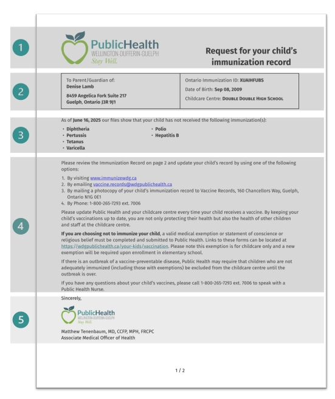
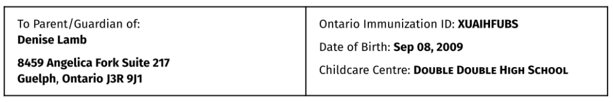
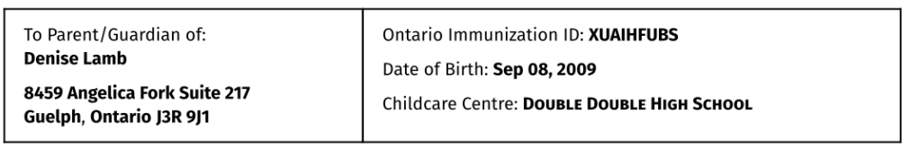
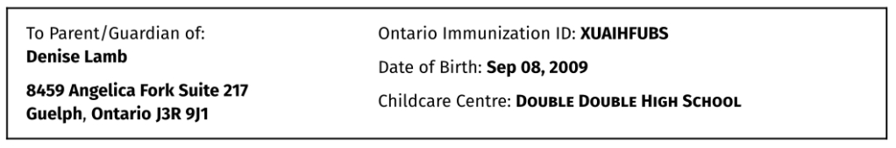
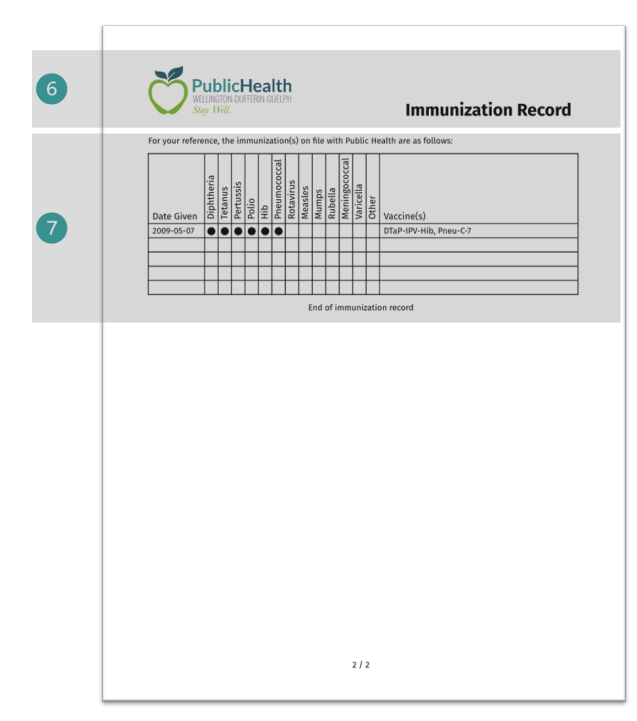
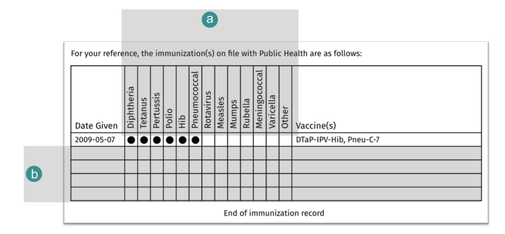
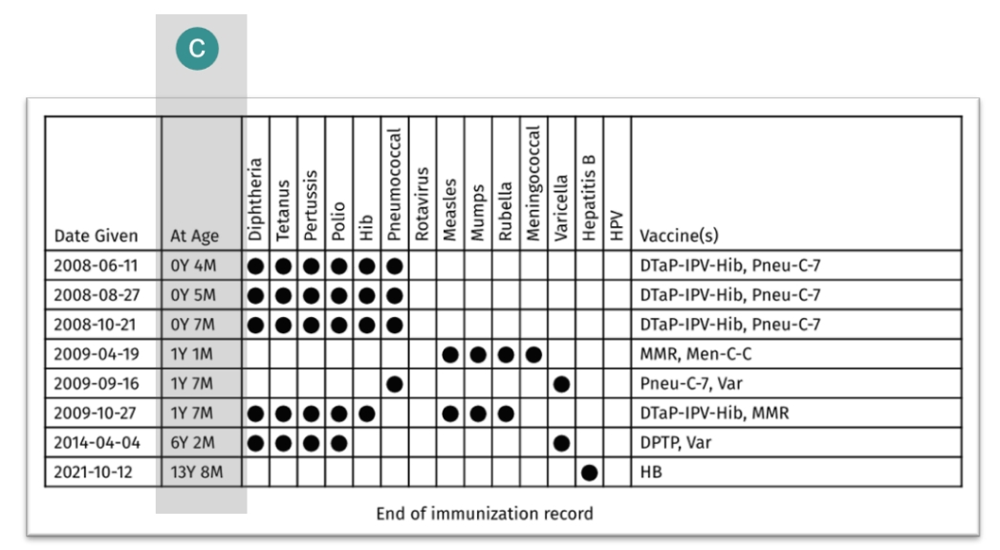

# Template Customization Options

Our immunization template has several components. Here, we dissect the template into dynamic components, allowing for customization for differing use cases.

## Pages

The base template consists of two pages:

1. Client Information and Messaging
2. Immunization History Chart

## Client Information and Messsaging Page

The Client Information and Messaging page consists of 5 customizable components: 

### 1. Header

The header consists of: 

* a `.png`, `.svg` or `.jpeg` file of your Public Health Units logo 
* messaging requesting immunization record. This messaging can be customized but **should not span more than 2 lines**

### 2. Client Information Table

#### Formatting 

The Client Information Table can be formatted in 1 of 4 ways: 

**Equal columns (50/50 split) with vertical line:**

**Unequal columns (40/60 split) with vertical line:**

**Equal columns (50/50 split) without vertical line:**

**Unequal columns (40/60 split) without vertical line:**

#### Dynamic Content 

The content within the box contains the following information about the child: 
* Name
* Address
* City 
* Province
* Postal Code
* Ontario Immunization ID or Client ID 
* Date of Birth
* Childcare Centre or School

When the child is over 16 years of age, the letter is addressed directly to the student rather than to their Parent/Guardian.

### 3. Immunization List

The immunization list is an optional component. It lists all outstanding immunizations for the client. 

Should the list be longer than 5 immunizations, the template creates columns to optimize formatting and ensure that the letter length is constrained to a single page (2 pages total with the immunization history chart).

The messaging prior to the immunization list can be customized according to your preference. We recommend keeping a data in the message to ensure that the client is aware of when the immunization data was pulled from the system.

### 4. Messaging

The messaging is fully customizable based on the Public Health Unit's needs.

### 5. Signature

The signature consists of 3 components: 

1. A `.png`, `.svg`, `.jpeg` file of the signature (in the diagram we use a logo as a placeholder for the signature)
2. The name of the sender
3. The title of the sender 

## Immunization History Chart

The immunization history chart is rendered on the second page of the report.

There are 2 main components on the immunization history page (marked as 6 and 7 on the
image above):

6. Header
7. Immunization History Chart

### 6. Header 

The header consists of: 

* `.png`, `.svg`, or `.jpeg` file of your PHUs logo
* Title of page: "Immunization Record

### 7. Immunization History Table

There are several components of the immunization table. We have further broken down the components in the image below: 

(a) Names of diseases

These can be customized. In some cases, other may be replaced with HPV , for instance,
depending on the age of the use case for the reports.

(b) Minimum number of rows in table

Here, if the number of rows is less than 5, we pad the table with blank rows for aesthetic
purposes. The minimum number of rows can be adjusted based on preference.

(c) You may also wish to customize the chart to include an additional column "At Age"

